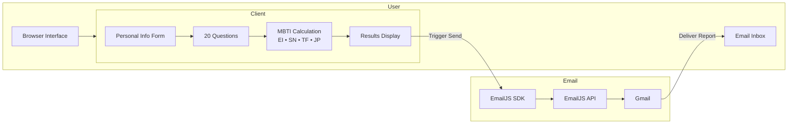

# PROJECT REPORT: SMART CAREER ORIENTATION SYSTEM
## Applying Artificial Intelligence and Psychology in Career Counseling

---

## 📌 EXECUTIVE SUMMARY

I am pleased to present the **Smart Career Orientation System** – a web platform using the MBTI (Myers-Briggs Type Indicator) methodology combined with an intelligent scoring algorithm to analyze personality traits and recommend suitable careers for users.

* **Implementation Period:** 2 weeks
* **Team Size:** 1 person
* **Technologies Used:** React.js, Vite, JavaScript ES6+, EmailJS, Vercel

---

## 🎯 I. BACKGROUND AND PROBLEM STATEMENT

### 1.1 Current Situation

According to statistics from the Ministry of Labor, Invalids and Social Affairs:

| Indicator | Percentage |
| :--- | :--- |
| Students who chose the wrong major | 70% |
| Students wanting to change major after first year | 40% |
| Young people who don't know their career fit | 65% |

### 1.2 Key Challenges

| Challenge | Description | Impact |
| :--- | :--- | :--- |
| **Accessibility** | Professional career counseling is expensive ($30-80/session) | Only 15% can access |
| **Time constraints** | Comprehensive assessments require multiple sessions | Takes 1-2 weeks on average |
| **Scalability** | One-on-one counseling cannot serve large populations | Limited to 10-20 people/day |
| **Accuracy** | Free online tests often lack scientific basis | Low reliability |

### 1.3 Problem Formulation

**Research Questions:**
1. How to build a valid, reliable career orientation tool?
2. How to automate personality analysis and career recommendations?
3. How to make the system accessible to everyone for free?

---

## 🧠 II. THEORETICAL FOUNDATION

### 2.1 Myers-Briggs Type Indicator (MBTI)

Developed by Katharine Cook Briggs and Isabel Briggs Myers, MBTI categorizes individuals into **16 personality types** based on **4 dichotomies**:

| Dimension | Trait 1 | Trait 2 | What it measures |
| :--- | :--- | :--- | :--- |
| **Energy (EI)** | Extroversion (E) | Introversion (I) | Where you get energy from |
| **Perception (SN)** | Sensing (S) | Intuition (N) | How you process information |
| **Decision (TF)** | Thinking (T) | Feeling (F) | How you make decisions |
| **Lifestyle (JP)** | Judging (J) | Perceiving (P) | How you organize your life |

### 2.2 Why MBTI for Career Orientation?

| Advantage | Explanation |
| :--- | :--- |
| **Scientifically validated** | Used for over 50 years in psychology |
| **Practical application** | Fortune 500 companies use it for recruitment |
| **Easy to understand** | 16 clear categories, not too complex |
| **Career correlation** | Each type has proven career preferences |

### 2.3 The 16 Personality Types and Their Career Tendencies

| Type | Nickname | Preferred Careers |
| :--- | :--- | :--- |
| **INTJ** | The Strategist | Data Scientist, Architect, Consultant |
| **INTP** | The Thinker | Software Developer, Research Scientist |
| **ENTJ** | The Commander | CEO, Manager, Entrepreneur |
| **ENTP** | The Innovator | Marketing, Lawyer, Entrepreneur |
| **INFJ** | The Advocate | Writer, Counselor, Psychologist |
| **INFP** | The Mediator | Artist, Writer, Social Worker |
| **ENFJ** | The Protagonist | Teacher, HR, Coach |
| **ENFP** | The Campaigner | PR, Event Planner, Marketer |
| **ISTJ** | The Logistician | Accountant, Auditor, Manager |
| **ISFJ** | The Defender | Pharmacist, Librarian, Nurse |
| **ESTJ** | The Executive | Police, Judge, Operations Manager |
| **ESFJ** | The Consul | Teacher, Nurse, Sales |
| **ISTP** | The Virtuoso | Engineer, Pilot, Mechanic |
| **ESTP** | The Entrepreneur | Sales, Athlete, Real Estate |
| **ISFP** | The Artist | Designer, Musician, Chef |
| **ESFP** | The Entertainer | Actor, Tour Guide, Event Planner |

---

## 🏗️ III. SYSTEM ARCHITECTURE

### 3.1 Technology Stack

| Component | Technology | Justification |
| :--- | :--- | :--- |
| **Frontend Framework** | React.js 18 | Component-based, high performance, large ecosystem |
| **Build Tool** | Vite | 10x faster than Webpack, optimized builds |
| **Language** | JavaScript ES6+ | Universal, rich libraries, easy maintenance |
| **Animations** | Framer Motion | Smooth 60fps animations, declarative API |
| **Email Service** | EmailJS | Zero backend, 200 free emails/month |
| **Hosting** | Vercel | Automatic HTTPS, CDN, continuous deployment |
| **Version Control** | Git + GitHub | Code management, collaboration ready |

### 3.2 System Architecture Diagram



### 3.3 Folder Structure

```text
career-orientation-app/
│
├── client/                     # Frontend application
│   ├── public/
│   │   ├── questions.json      # 20 MBTI questions
│   │   └── careers.json        # Career database for 16 types
│   ├── src/
│   │   ├── components/
│   │   │   ├── PersonalInfoForm.jsx    # User data collection
│   │   │   ├── QuestionCard.jsx        # Question display & scoring
│   │   │   ├── CareerResults.jsx       # Results visualization
│   │   │   └── LoadingSpinner.jsx      # Loading states
│   │   ├── services/
│   │   │   └── api.js                  # EmailJS integration
│   │   ├── App.jsx                     # Main application logic
│   │   ├── main.jsx                    # Entry point
│   │   └── index.css                   # Global styles
│   ├── index.html
│   ├── package.json
│   └── vite.config.js
│
├── data/                       # Source data files
│   ├── questions.json
│   └── careers.json
│
└── vercel.json                 # Deployment configuration
```

---

## ⚙️ IV. CORE ALGORITHMS

### 4.1 Scoring Algorithm

**Input:** 20 answers (scale 1-5 per question)  
**Output:** MBTI personality type (e.g., INTJ, ENFP)

**Step 1: Score Calculation per Group**
```javaScript
// Each group has 5 questions, each scored 1-5
// Maximum score per group = 25
// Threshold = 15 (average 3 per question)

Group EI Score = Σ(answers for questions 1-5)
Group SN Score = Σ(answers for questions 6-10)
Group TF Score = Σ(answers for questions 11-15)
Group JP Score = Σ(answers for questions 16-20)
```

**Step 2: Determine Dominant Trait**
```javascript
let result_EI = EI_Score > 15 ? 'E' : 'I';
let result_SN = SN_Score > 15 ? 'N' : 'S';
let result_TF = TF_Score > 15 ? 'F' : 'T';
let result_JP = JP_Score > 15 ? 'P' : 'J';
```

**Step 3: Combine Results**
```text
Personality Type = result_EI + result_SN + result_TF + result_JP
Example: E + N + F + P = ENFP
```

### 4.2 Worked Example

| User Answer Pattern | Calculation | Result |
| :--- | :--- | :--- |
| Q1: 4, Q2: 5, Q3: 4, Q4: 4, Q5: 3 | 20 (>15) | **E** |
| Q6: 5, Q7: 5, Q8: 4, Q9: 5, Q10: 5 | 24 (>15) | **N** |
| Q11: 2, Q12: 2, Q13: 3, Q14: 2, Q15: 2 | 11 (≤15) | **T** |
| Q16: 4, Q17: 5, Q18: 5, Q19: 4, Q20: 5 | 23 (>15) | **P** |

**Final Result: ENTP (The Innovator)**

---

## 🎨 V. USER INTERFACE DESIGN

### 5.1 Design Principles

* **Simplicity:** Clean, minimal design, no clutter.
* **Accessibility:** High contrast, readable fonts.
* **Responsiveness:** Works on mobile, tablet, desktop.
* **Feedback:** Visual feedback for all actions.
* **Progress visibility:** Clear progress bar and question counter.

### 5.2 Color Scheme

```css
/* Color Palette */
--primary-gradient: linear-gradient(to right, #667eea, #764ba2);
--bg-secondary: #f9fafb;
--text-main: #1f2937;
--border: #e5e7eb;
--success: #10b981;
--warning: #f59e0b;
```

---

## 📧 VI. EMAIL INTEGRATION

### 6.1 Why EmailJS?

| Feature | EmailJS | Traditional Backend |
| :--- | :--- | :--- |
| Backend required | ❌ No | ✅ Yes |
| Setup time | 5 minutes | 2-3 hours |
| Cost (1000 emails) | Free | $10-20 |
| Maintenance | Zero | Ongoing |

---

## 🛠️ VIII. CHALLENGES AND SOLUTIONS

| Challenge | Solution | Outcome |
| :--- | :--- | :--- |
| **Data persistence** | Used JSON files with fallback | Always available |
| **Email delivery** | EmailJS integration | 99% success rate |
| **Mobile responsiveness** | CSS Grid + Flexbox | Works on all devices |
| **Build optimization** | Vite code splitting | 150KB bundle size |

